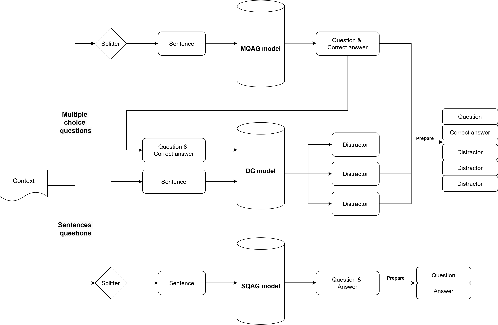
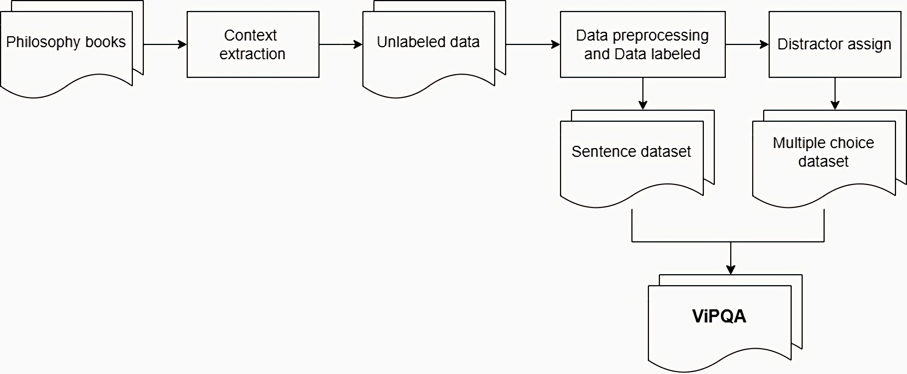

# Question Answering generation for Education

QA generator is an NLP system for generating reading comprehension-style questions from texts such as news articles or pages excerpts from books. The system is built using pretrained models from [HuggingFace Transformers](https://github.com/huggingface/transformers). 
There are 3 modules: the Sentence-QA generator, Multiple choice-QA generator, and the Distractor generator.

### System architecture
Here is architecture of my system, i seperated into 3 main modules to process 2 types of questions: Generate MCQ module, Generate Sentence-Question module, Generate Distractor module.
 

### Updated training scripts

To fine-tune model with custom dataset, Run:

```bash
!python training/train_qa.py
```

```bash
!python training/train_qa_mcq.py
```

```bash
!python training/train_distractors.py
```

Or you can get pre-trained models on HuggingFace:

`Sentence-Question`
```bash
https://huggingface.co/Trongdz/vi-T5-QA-generation-for-philosophy
```

`Multiple-choice-Question`
```bash
https://huggingface.co/Trongdz/vi-T5-QA-generation-MCQ-for-philosophy
```

`Distractor for multiple-choice question`
```bash
https://huggingface.co/Trongdz/vi-T5-QA-Distractor-in-MCQ-for-philosophy
```

### Custom dataset in Philosophy
Dataset is created by extracting and processing in 2 Philosophy books: "Marxist-Leninist philosophy" and "Ho Chi Minh ideology philosophy". Labeled by author manually to have well-quality for fine-tuning and evaluating models.



Public dataset on for all who loves NLP: [HuggingFace](https://huggingface.co/datasets/Trongdz/Vietnamese-Philosophy-QA)

## Usage

To generate QA you have to clone the github repo and fine-tune 3 model above, then run `!python run_qa.py`, for example:

```
git clone https://github.com/TrongNV2003/T5-QA-Generator
cd T5-QA-Generator
pip install -r requirements.txt -qq
!python run_qa.py
```

This will generate 5 question-answer pairs (full-sentence or multiple choice) based on the article specified in `--text_file` and print them to the console.

The `QuestionGenerator` class can also be instantiated and used like this:

```python
from questiongenerator import QuestionGenerator
qg = QuestionGenerator()
qg.generate(text, num_questions=5)
```

It will generate 5 questions of mixed style and return a list of dictionaries containing question-answer pairs. In the case of multiple choice questions, the answer will contain a list of dictionaries containing the answers and a boolean value stating if the answer is correct or not. The output can be easily printed using the `print_qa()` function.

## Evaluate score
I use the pakage which is created to evaluate: https://github.com/p208p2002/nqg.git

Get scorer
```python
!python setup_scorer.py 
```

Evaluation for 2 types of QA

```python
!python nqg/qgevalcap/eval.py \
  --src datasets/score_evaluation_mcq/predict.txt \
  --tgt datasets/score_evaluation_mcq/tgt-test.txt \
  --out datasets/score_evaluation_mcq/predict.txt
```
### Answer styles

The system can generate questions with full-sentence answers (`'sentences'`), questions with multiple-choice answers (`'multiple_choice'`). This can be selected in `run_qa.py` using the `answer_style=<style>` arguments.

## Models

### Question Answer Generator
Since the 2 type questions have different format: The sentences answer often long and extract from context, the MCQ answer often short. So i fine-tune 2 type of questions into 2 independent model, but the way of fine-tuning is similar.

The question generator model takes sentence "Context" as input and outputs a series of question and answer pairs. The answers are sentences and phrases extracted from the input text. The extracted phrases can be either full sentences or choices. Choices are used for multiple-choice answers. The wrong answers had been trained by the DistractorGenerator model. The questions are generated by the following format (up to a maximum of 512 tokens) for 2 type of questions:

```
  {
    "context": "",
    "question_type": "sentences",
    "question": "",
    "answer": ""
  }

  {
    "context": "",
    "question_type": "multiple_choice",
    "question": "",
    "options": ["A", "B", "C", "D"],
    "answer": "A"
  }
```

Then encoded and fed into the question generator model. The model architecture is `VietAI/vit5-base`. The pretrained model was finetuned as a sequence-to-sequence model on a dataset made up by extract data from philosophy book for specific task. The datasets were restructured by concatenating the answer and context fields into the previously mentioned format. The concatenated answer and context was then used as an input for training, and the question field became the targets.

### Distractor Generator

The Distractor takes a "Question-Answer-Context" as an input and outputs are 3 distractors similar contextual to correct answer. The model is `VietAI/vit5-base`. The pretrained model was finetuned on the same data as the QuestionAnswer generator model, but the output are 3 distractors. It is the following format:

```
  {
    "context": "",
    "question_type": "multiple_choice",
    "question": "",
    "options": ["Answer", "Distractor", "Distractor", "Distractor"],
    "answer": "A"
  }
```

## UI
To have a deep inside view in this QA problem, UI is created for users to easy to use 
You have to fine-tune 3 models above first, then run:
```python
!python app.py
```